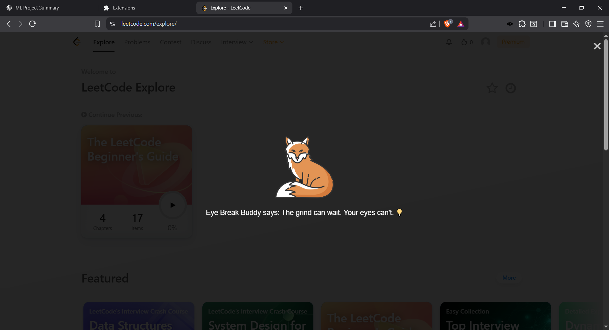
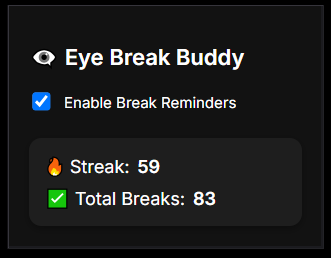
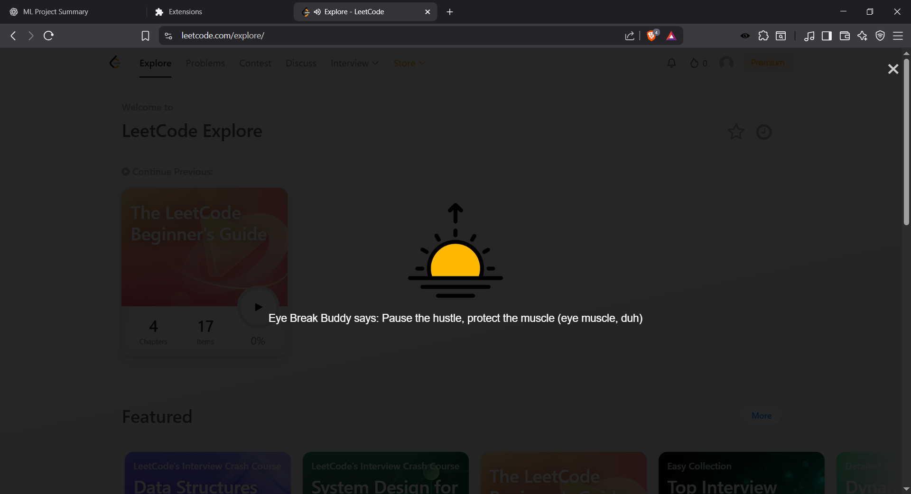
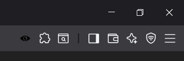

# 👁️ Eye Break Buddy

**Take care of your eyes, one 20-second break at a time.**  
Eye Break Buddy is a minimalist Chrome/Brave extension that gently reminds you to rest your eyes every 20 minutes — with adorable animal mascots and quirky puns that you can't ignore.

---

## 🧠 Why This Exists

Too much screen time strains your eyes, affects focus, and leads to burnout.  
The **20-20-20 rule** (every 20 minutes, look 20 feet away for 20 seconds) is a science-backed way to reduce digital eye strain.  
This extension turns that rule into something *fun*, *cute*, and *actually effective*.

---

## ✨ Features

- ⏰ **Automatic Reminders** every 20 minutes
- 🐼 **Cute Animal Mascots** with themed PNGs
- 📝 **Random Eye-Care Puns** and gentle nudges
- 🔇 **Pauses videos/audio** during breaks
- 🔊 **Chime Sound** plays when break ends
- 📈 **Streak Tracker** for consistency
- 🌑 **Dark Overlay** so your eyes really rest
- 🙈 **One-Click Toggle** when you’re busy or in meetings

---

## 🖼️ Screenshots

| Overlay Break Example | Popup |
|-----------------------|-------|
|  |  |
|  |  |

---

## 👁️ Always Watching... Out for You

  

> 🎶 *"I always feel like... somebody’s watching me..."*  
> That *somebody* is your friendly **Eye Break Buddy** 👁️  
> Keeping an eye on your screen time, not your secrets.

---

## 🔧 How It Works

1. Every 20 minutes, a dark overlay appears.
2. A random **animal mascot** and **punny message** is displayed.
3. Any media playing (videos, audio) **pauses**.
4. After 20 seconds, or on manual close, the overlay disappears, media resumes, and your **streak gets updated**.

---

## ✅ Installation (for Testing)

1. Clone or download this repo.
2. Open `chrome://extensions/` in your browser.
3. Enable **Developer Mode** (top-right corner).
4. Click **“Load unpacked”** and select the `Eye-Break-Buddy` folder.
5. Done! You’ll start getting reminders every 20 minutes.

---

## 🚀 Future Plans

- Customizable reminder intervals
- Sound on/off toggle
- Theme & mascot picker
- Break productivity stats

---

## 💖 Credits

- Mascot PNGs from [Flaticon](https://www.flaticon.com/) (G-CAT, Freepik, BSD, Mehwish, Vitaly Gorbachev)
- Crafted with caffeine, care & a tiny bit of chaos 💻☕✨ by **Nischitha**

---
